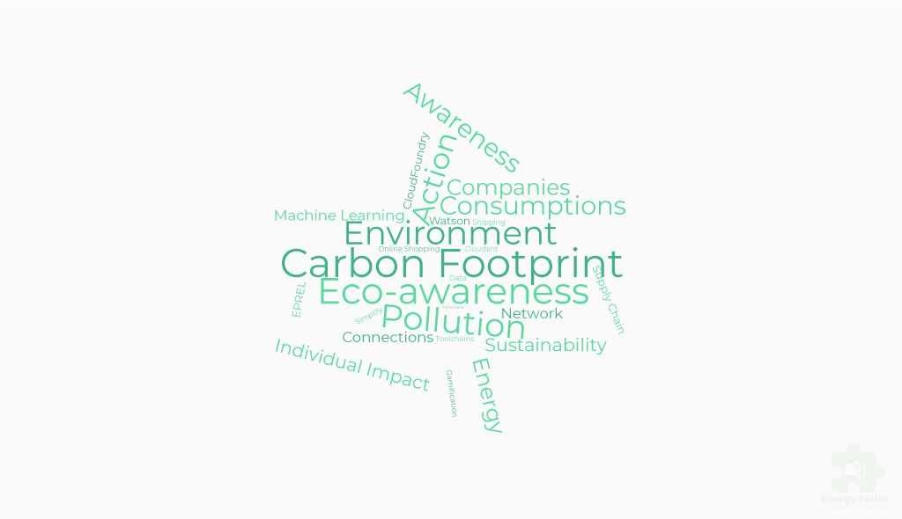
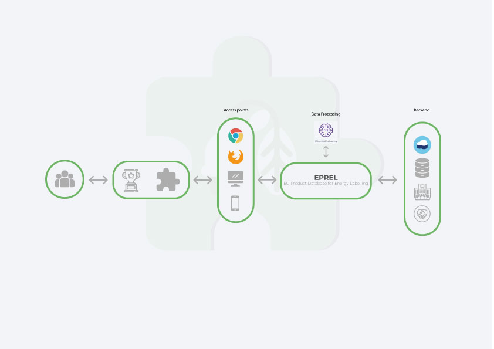

# Terra Care Extension - Call for Code

## Contents

1. [Short description](#short-description)
1. [The idea](#the-idea)
1. [Long description](#long-description)
1. [Demo video](#demo-video)
1. [Word Cloud](#word-cloud)
1. [The architecture](#the-architecture)
1. [Project roadmap](#project-roadmap)
1. [Getting started](#getting-started)
1. [Live demo](#live-demo)
1. [Built with](#built-with)
1. [Authors](#authors)


## Short description
Eco alternatives on the fly, **save the Environment from your screen.**


### **The idea**
>*“Any sufficiently advanced technology is indistinguishable from magic".*
Clarke's three laws

Using Data from:
 * **EPREL**, the European Product Registry for Energy Labelling. 
* **Producer** and buyer locations to calculate travel distance.
* Informations about the products and its **production processes**. 

But mostly: thanks to **IBM Watson ML and IBM Services**. We will be able to develop a **Machine Learning model** capable of finding alternative and more sustainable, products, served to the Users via a **simple browser extension.**

## Long description

Here you can read [A brief statement of **Our Vision** 👈](LONG_DESCRIPTION.md)


## Demo video

[](https://youtu.be/lfMkRlTaE3M)


## Word cloud



## Project roadmap


## The architecture



## Getting started
>*The extension is planned to be released for Firefox and other popular browser at a later time.*

### Prerequisites
- A laptop or a PC
- **Chrome** browser

### Installing
* Download this repository to your device
* Open Chrome
* Write in the URL search bar
```
chrome://extensions   
```
* Activate developer mode (extension is  not yet deployed) :)
* Click on Load Unpacked and upload the folder "extension-source"
* Navigate to an Amazon product page and click on the "Compare Items" button.

**Enjoy!**

## Live demo
**[Visit now our live Demo!](https://extension-landing-page.eu-gb.mybluemix.net/#/)** 👈


## Built with

* [IBM Cloud](https://cloud.ibm.com/)
* [IBM Cloud Foundry](https://www.cloudfoundry.org/the-foundry/ibm-cloud-foundry/)
* [IBM Pipeline](https://www.ibm.com/garage/method/practices/deliver/tool_delivery_pipeline/)

### And planned with
* [IBM Watson](https://www.ibm.com/watson)


## Authors

* **Alex Duthie**: [Linkedin](https://www.linkedin.com/in/alexduthielnkdn/) - [Github](https://github.com/AlexDuthie)
* **Andrew Ellen**: [Linkedin](https://www.linkedin.com/in/andrew-ellen-3719361b5/) - [Github](https://github.com/AndyE77)
* **Damir Elsik**: [Linkedin](https://www.linkedin.com/in/damir-elsik-36452b1b8/)
* **Scott Graham**: [Linkedin](https://www.linkedin.com/in/scott-graham-42aa6b190/) - [Github](https://github.com/scottnotscott)
* **Vittorio Rivabella**: [Linkedin](https://www.linkedin.com/in/vittorio-rivabella/) - [Github](https://github.com/Eversmile12)

TerraCare is brought to you by a team of five 1st year Software development BSc students from the [University of the Highlands and Islands.](https://www.uhi.ac.uk/en/courses/bsc-hons-applied-software-development/)

Thank you for reading our submission! 
