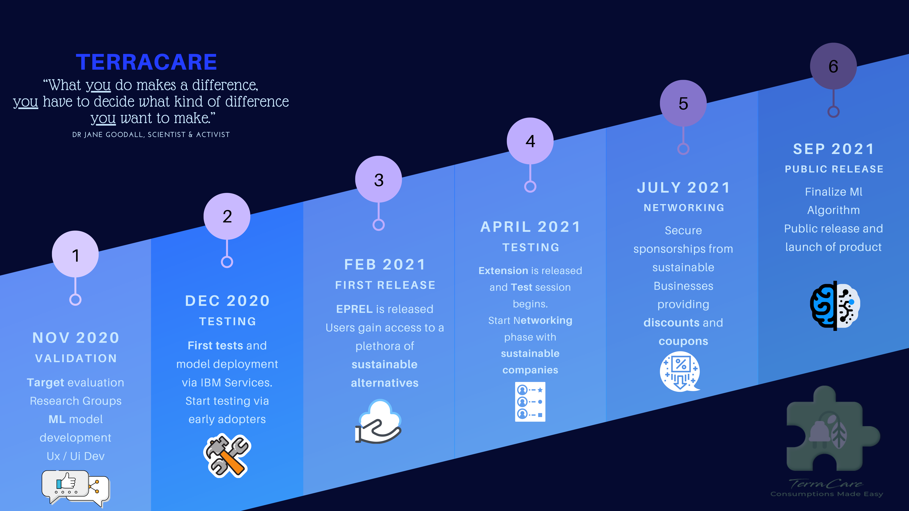
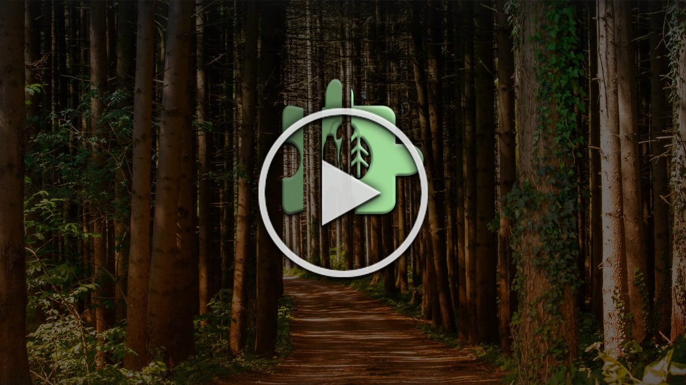

# Official Repository for [TerraCare](https://extension-landing-page.eu-gb.mybluemix.net/#/)

**1st Prize Winner of [IBM](https://www.ibm.com/)'s 2020 Call for Code *[University Spot](https://developer.ibm.com/blogs/call-for-code-university-spot-challenge-europe-middle-east-and-africa-students-versus-climate-change/)* Challenge in Energy Sustainablity**

## Contents

1. [TerraCare Web Prototype](#terracare-web-prototype)
1. [Short Description](#short-description)
1. [Long Description](#long-description)
1. [Services Used](#services-used)
1. [Video Demo](#video-demo)
1. [Roadmap](#terracare-roadmap)
1. [Extension Guide](#extension-installation-guide)
1. [Contributors](#contributors)

## TerraCare Web Prototype

[**Click Here**](https://extension-landing-page.eu-gb.mybluemix.net/#/)

> [**Back to Top**](#official-repository-for-terraCare)

## Short Description
Eco alternatives on the fly, **save the Environment from your screen.**

>*“Any sufficiently advanced technology is indistinguishable from magic"* - Clarke's three laws

> [**Back to Top**](#official-repository-for-terraCare)

## Long Description

[See Here](LONG_DESCRIPTION.md)

> [**Back to Top**](#official-repository-for-terraCare)

## Services Used

* [EPREL DB/API](https://ec.europa.eu/info/energy-climate-change-environment/standards-tools-and-labels/products-labelling-rules-and-requirements/energy-label-and-ecodesign/product-database_en)
* [IBM Cloud](https://www.ibm.com/uk-en/cloud)
* [IBM Watson](https://www.ibm.com/uk-en/watson)
* [IBM Pipeline](https://cloud.ibm.com/docs/ContinuousDelivery?topic=ContinuousDelivery-deliverypipeline_about)
* [IBM Cloud Foundry](https://www.cloudfoundry.org/the-foundry/ibm-cloud-foundry/)

> [**Back to Top**](#official-repository-for-terraCare)

## TerraCare Roadmap

> [**Back to Top**](#official-repository-for-terraCare)

## Video Demo

> [**Back to Top**](#official-repository-for-terraCare)

## Extension Installation Guide

* Clone this Repo
* Open Google Chrome Browser
 * Click the three dots in the top-right corner of Chrome Browser
 * Select 'More Tools'
 * Select 'Extensions'
 * Enable 'Developer Mode' on Extensions Page (top-right corner)
 * Select 'Load Un-Packed' (top-left of page)
 * Add the 'extension-source' folder
* Go to an [Amazon](www.amazon.com) page

*This will enable the extension*

> **The Extension only enables on [Amazon](www.amazon.com) at the moment**

> [**Back to Top**](#official-repository-for-terraCare)

## Contributors

* **Alex Duthie**: [Linkedin](https://www.linkedin.com/in/alexduthielnkdn/) - [Github](https://github.com/AlexDuthie)
* **Scott Graham**: [Linkedin](https://www.linkedin.com/in/scott-graham-42aa6b190/) - [Github](https://github.com/scottnotscott)
* **Vittorio Rivabella**: [Linkedin](https://www.linkedin.com/in/vittorio-rivabella/) - [Github](https://github.com/Eversmile12)

> [**Back to Top**](#official-repository-for-terraCare)
